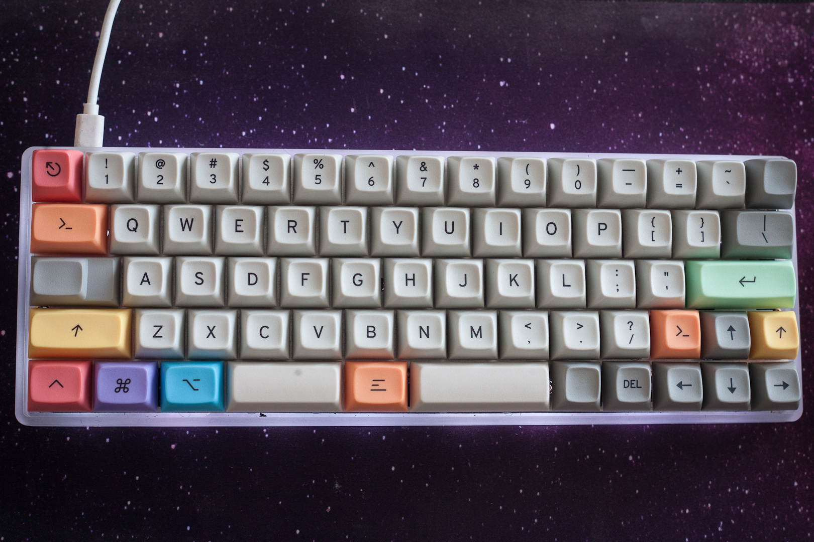

# My keymap for the kbdfans DZ60 with Split Spacebar

Make example for this keyboard and keymap:

    qmk compile -kb dz60 -km cae86
    docker cp container_name:/qmk_firmware/dz60_cae86.hex "C:\Users\User\Documents\QMK\dz60_cae86.hex"

CNC Type A plate, with `LAYOUT_directional` keymapping.

 * QWERTY ~~Colemak DH~~ ANSI layout
 * Home row mods for GASC
 * Miryoku inspired layers
 * RGB set to current layer color
 * Auto-shift on numbers and symbols

See also:
 - [Useful Excel Macros for QMK](excel_macros.md)
 - [Useful Excel Leaders for QMK](excel_leaders.md) (Work in progress)

# A photo of my keyboard

# Layers
## Home Rows Mods
> ⚡ Activate via: top-right corner key

- Toggled via top-right corner key. Enables home row mods and mod-taps on thumb keys.

## Excel Layer 
> ⚡ Activate via: `CapsLock`

- Layer with a few useful Excel macros:

| Macro      | Description |
| -----      | ----------- |
| `XL_APND`  | Append contents of clipboard to the end of the currently selected cell. |
| `XL_HCPY`  | Copies the contents of the cell to the clipboard. Differes from normal CTL+C in that the contents will stay in the clipboard if you deselect the source cell. |
| `XL_NTBL`  | Copies the selection to a new sheet, creates a table, changes the table style, and resets the column width and row heights. |
| `XL_FIXFX` | Fixes a table column from Text to General and re-applies the formula. Useful with tables from Sharepoint's "Export to Excel" feature. |
| `XL_NOW`   | Pastes time in current cell as value |

- Excel reset column width/row height on the arrow keys.

## Excel Filters Layer
> ⚡ Activate via: `Control`

 - Layer for filtering excel. Including:

| Macro      | Description                       |
| ---------- | ----------------------------------|
| `XL_FLTAPP`| Re-apply filters                  |
| `XL_FLTCLR`| Clear all filters                 |
| `XL_FLTEV` | Filter column by selected cell    |
| `XL_FLTEE` | Clear filter on selected column   |
| `XL_FLTNB` | Filter column to non-blanks only  |
| `XL_FLTBL` | Filter column to blank cells only |

 - Arrow keys select entire column or row, as well as extend selection to the corners (top-left, bottom-right).

 - Extra keys next to the arrow cluster Paste as Value (`XL_ESV`) and Paste Formatting Only (`XL_EST`).

## Navigation Layer
> ⚡ Activate via: `Alt`

- Home, End, PgUp, and PgDn on the arrow cluster. Ctrl+Home/End on the keys above Left- and Right-arrow.

- Select to Line Start (`SL_HOME`) and Select to Line End (`SL_END`) on the split spacebar.

- Move line up/down (`SWAP_UP`, `SWAP_DN`) and Select Column Cursor (`SL_CLUP`, `SL_CLDN`) on the keys to the left of the arrow cluster.

- Accents on the vowels (`äëïöü`) as well as some useful ASCII characters on the number row (`•ø—±°`).

## Backspace
> ⚡ Activate via: `Bspc` (between split spacebar keys)

- A few modifier backspace/del keys. 

- Also has the `RESET` key on the top-left corner, and dynamic macro record (`DM_REC_1`) on the top-right.

## Fn Layer
> ⚡ Activate via: `GUI`

- Fn keys on the number row. Modifiers (GUI, Alt, Shift, Control) in the LHS home mod row positions for modifying the Fn keys.

- VBA debugging macros on the LHS row below home row, and some additional on the RHS.

- Some useful Windows hotkeys on the LHS row above home row (Task Manager, File Explorer, Alt+F4, open commandline in current folder (`WE_CMD`)).

- Windows tile manager hotkeys on the arrow-cluster and bottom row:

| Macro      | Description                       |
| ---------- | ----------------------------------|
| `MM_LEFT`, `MM_RGHT` | Move window to left/right monitor on multi-monitor setups |
| `W_LEFT`, `W_RGHT`   | Split window left/right on current desktop |
| `W_UP`               | Maximize window |
| `W_DOWN`             | Restore/minimize window |
| `ALTTAB_L, ALTTAB_R` | Alt-Tab with stay-alive timer |

---